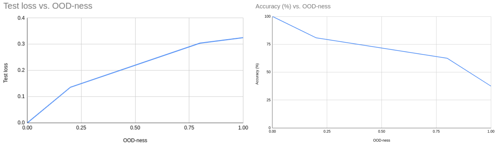

# MLC-ARC_gym
Evaluating MLC method on ARC_gym

## Introduction

MLC stands for "Meta-Learning Compositionally", a method based on Transformers and meta-learning. The related paper is: [Human-like systematic generalization
through a meta-learning neural network](https://www.nature.com/articles/s41586-023-06668-3.pdf), by Lake & Baroni (2023).

This experiment aims to show that a Transformer, trained in an "in-context" manner, is unable to learn to generalize structurally to new tasks. This is done by leveraging
the ARC_gym framework. The experiment consists of different model training and evaluation runs, using meta-datasets whose training set vs test set overlap differs each time.
By controlling the number of nodes used to generate the ARC_gym training tasks and the ARC_gym test tasks in each training/evaluation run, I can approximately control the
degree of overlap (i.e. "out-of-distributionness") of the run.

## Experiment

An OOD-ness of 1 means that there is no overlap between the training and test set in terms of the generated task structures. This is the most difficult scenario for the
transformer. An OOD-ness of 0 means that every task in the test set has an equivalent instance in the training set -- so the ability to memorize the training set is sufficient
to get an accuracy of 100%. Training on 1000 randomly generated tasks each time, and evaluating on 10 randomly generated tasks, the experiment results are summarized in this graph:

The left chart indicates the evolution of the test loss. As you would expect from a learning algorithm that fails to generalize out-of-distribution on task structure, it increases
as we decrease the overlap between training and test tasks (i.e., as the test tasks become increasingly out-of-distribution w.r.t. to the training distribution). On the right,
we see the test set accuracy. At maximum OOD-ness levels, it reaches about 37% in the experiments that I've run.

## Interpretation of Results

At a high level, this experiment supports the idea that Transformers struggle with the ability to learn to generalize to structurally distinct tasks. This corroborates the findings of the paper ([Human-like systematic generalization
through a meta-learning neural network](https://www.nature.com/articles/s41586-023-06668-3.pdf), by Lake & Baroni (2023)) from which the Transformer architecture and training methdology was taken.

The lack of generalization to higher OOD-ness values is almost certainly **not** due to a lack of model capacity/parameters, because:
1. It successfully learns the tasks at the lower OOD-ness values
2. The training curve shows that the training loss reaches near zero values. It learns the training set, but it's simply unable to learn it in a way that generalizes to the test set.

One could argue that by training long enough, the Transformer could "Grok" the underlying task structures and learn to generalize. I have not tried this, and generally the grokking phenomenon has been observed on OOD variations of a same task structure (e.g. generalizing to a different grid distribution), not in meta-learning setting like this where the algorithm must generalize to new tasks.

I have tried training on different amounts of distinct tasks: 100, 500, 1000, 2000, and even 5000. The best results I've seen were at 1000. It does not appear to be the case that scaling up the number of distinct training tasks past around 1000 samples improves the test set generalization performance. Keep in mind the DSL is relatively small and relatively trivial.

I also have tried the opposite: training on larger tasks of [5, 6] nodes and testing on smaller tasks of [2, 3] nodes. The results are even worse. So the OOD-ness issue isn't just about generalizing to longer tasks. It's fundamentally about generalizing to **different** tasks.

It is worth noting that, however, the accuracy does not reach **0%** even at the higher OOD-ness levels. This is worth investigating further, and I have a few hypotheses at the moment:

1. The fact that a test set does not have an exactly equivalent task in the training set does not mean that it can't be generalized to via interpolation. For example, imagine a task in the training set that consists of translating the foreground pixels diagonall to the upper right, and then setting its foreground pixels to a different color. If one of the 10 test tasks has an identical task, except for the fact that the target pixel color has never been seen during training, it could be reasonable to expect the transformer to interpolate to that task from training. In other words, it's possible that interpolation can produce a small amount of generalization across structurally different tasks if they are sufficiently similar to training tasks.

2. There might be a bug in how I calculate OOD-ness that over-estimates the degree of OOD-ness.

## Usage

Run the eval.py script to run a training/evaluation session. You must open the eval.py file and adjust the lines 18 to 25 to reflect the amount of overlap in number of primitives
to chain together to create a task. Identical values between the training num_nodes interval and the test num_nodes interval will give a meta-dataset whose test set is entirely within distribution of the training set. Creating a sufficient large gap between the intervals should generate a meta-dataset with an OOD-ness level at 1, or near 1. The script will calculate that OOD-ness level and display it on the console before initiating training.

Code for the MLC algorithm is taken from : https://github.com/brendenlake/MLC-ML

To use the code, you must install ARC_gym: https://github.com/SimonOuellette35/ARC_gym
